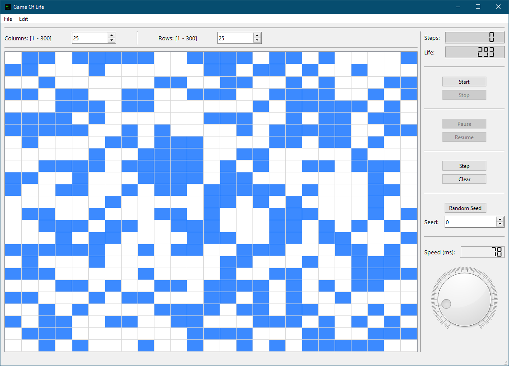

# Game of Life

## Project Description
The **Game of Life** is a zero-player game created by mathematician John Horton Conway. It's a simulation of cell evolution on a two-dimensional grid, where each cell can exist in one of two states: **alive** or **dead**. The state of the entire grid evolves in discrete time steps according to a simple set of rules based on the states of neighboring cells.

This project is my implementation of the Game of Life in **C++**, utilizing the **Qt** library for the graphical interface.

## Preview  


## Features
- **Graphical Interface**: A user-friendly interface that allows for easy control of the simulation.
- **Dynamic Grid**: Ability to adjust the grid size according to your preferences.
- **Manual Setting of Initial State**: Users can manually set the initial state of the cells.
- **Simulation Speed Control**: Option to control the speed of cell evolution.
- **Save and Load**: Ability to save the current game state and load it at a later time.
- **Customizable Cell Colors**: Users can change the color of living and dead cells.

## Conway's Game Rules
- **Survival**: A living cell with **2 or 3** living neighbors remains alive.
- **Death by Loneliness**: A living cell with **fewer than 2** living neighbors dies.
- **Death by Overpopulation**: A living cell with **more than 3** living neighbors dies.
- **Birth**: A dead cell with **exactly 3** living neighbors becomes alive.

## Technologies
- **Programming Language**: C++
- **Library**: Qt 6.8.0
- **IDE**: Qt Creator
- **Build System**: qmake

---
### How to Run
1. Clone the repository:
   ```sh
   git clone https://github.com/your-username/game-of-life.git
   cd game-of-life
   ```
2. Open the project in **Qt Creator**.
3. Configure the project using **qmake**.
4. Build and run the application.

Enjoy simulating Conway's Game of Life! 🚀
